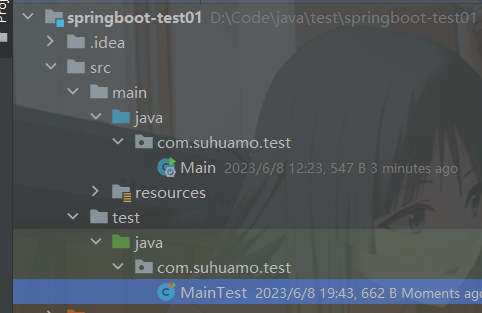
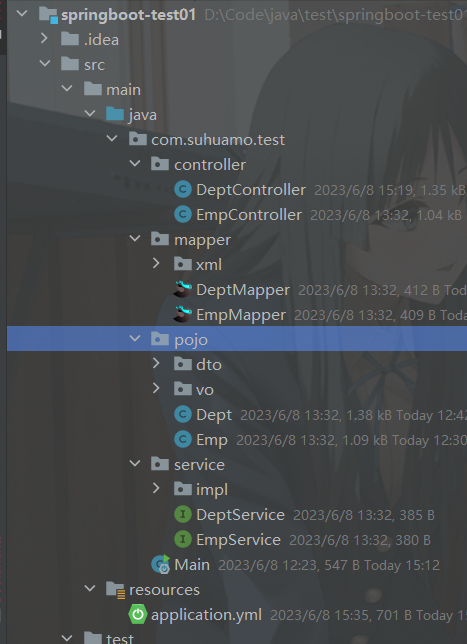
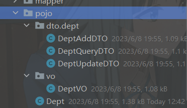
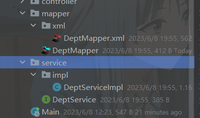

# 一个基础web的spring-boot-starter框架

## web-spring-boot-starter

## 前言

1. 对应一个web项目的开发，数据库实体类的生成，controller的增删改查接口每次都需要重复的创建，这样是十分麻烦且没有必要的。因此本项目上线，提供了一套基础的自动生成代码，包含了实体类的生成，controller接口的增删改查生成等。
1. 同时一些基础的功能也是比较常用的，如Jwt鉴权，跨域配置、统一异常处理等，该项目同样接入了这些功能，在无代码侵入的情况下，引入该项目，即可配置完成这些模块。

## 系统环境配置

  

## 当前版本

- 本地: 1.0.0
- 远程仓库: 1.0.0

## 快速上手
### 一、创建一个空的maven项目

### 二、安装依赖

#### 第一种： 
1. 将此工程通过``mvn clean install``打包到本地仓库中。 
2. 在你的工程中的``pom.xml``中添加如下依赖
3. 建议使用idea右侧自带的maven插件进行打包，如果要在终端输入命令打包，建议先输入 `java -version` 看看当前配置是否为jdk17。
```xml
	<dependency>
		<groupId>com.suhuamo</groupId>
		<artifactId>web-spring-boot-starter</artifactId>
    <!--        版本可自行配置，1.0.0版本一定可以运行-->
		<version>1.0.0</version>
	</dependency>
```
#### 第二种：
​	本项目已经上传到了jitPack的中央仓库中，故用户可以直接通过maven下拉使用，pom.xml中的配置如下，

```xml
    <repositories>
        <!--        配置jitpack的远程仓库-->
        <repository>
            <id>jitpack.io</id>
            <url>https://www.jitpack.io</url>
        </repository>
    </repositories>

    <dependencies>
        <dependency>
            <groupId>com.github.suhuamo</groupId>
            <artifactId>web-spring-boot-starter</artifactId>
        <!--        版本可自行配置，1.0.0版本一定可以运行,版本跟随发行版更新-->
            <version>1.0.0</version>
        </dependency>
    </dependencies>
```
#### 一个demo项目中的pom.xml的完整配置
```xml
<?xml version="1.0" encoding="UTF-8"?>
<project xmlns="http://maven.apache.org/POM/4.0.0"
         xmlns:xsi="http://www.w3.org/2001/XMLSchema-instance"
         xsi:schemaLocation="http://maven.apache.org/POM/4.0.0 http://maven.apache.org/xsd/maven-4.0.0.xsd">
    <modelVersion>4.0.0</modelVersion>

    <parent>
        <artifactId>spring-boot-starter-parent</artifactId>
        <groupId>org.springframework.boot</groupId>
        <version>3.0.0</version>
    </parent>

    <groupId>com.suhuamo.test</groupId>
    <artifactId>springboot-test01</artifactId>
    <version>1.0-SNAPSHOT</version>

    <properties>
        <maven.compiler.source>17</maven.compiler.source>
        <maven.compiler.target>17</maven.compiler.target>
        <project.build.sourceEncoding>UTF-8</project.build.sourceEncoding>
    </properties>

  <repositories>
    <repository>
      <id>jitpack.io</id>
      <url>https://www.jitpack.io</url>
    </repository>
  </repositories>

    <dependencies>
        <!--        自定义的web类-->
        <dependency>
            <groupId>com.github.suhuamo</groupId>
            <artifactId>web-spring-boot-starter</artifactId>
            <version>1.0.0</version>
        </dependency>
        <!--        springboot测试类 -->
        <dependency>
            <groupId>org.springframework.boot</groupId>
            <artifactId>spring-boot-starter-test</artifactId>
            <scope>test</scope>
        </dependency>
        <!--        mysql驱动 -->
        <dependency>
            <groupId>com.mysql</groupId>
            <artifactId>mysql-connector-j</artifactId>
            <scope>runtime</scope>
        </dependency>
        <!--        配置文件提示启动器-->
        <dependency>
            <groupId>org.springframework.boot</groupId>
            <artifactId>spring-boot-configuration-processor</artifactId>
            <!--            设置为ture，则不会被其他项目共享-->
            <optional>true</optional>
        </dependency>
    </dependencies>

</project>
```
### 三、配置参数
​	在``application.properties``或者``application.yml``中做如下的配置，即文件中只需要如下参数即可
，其他参数如jdbc的链接，mybaits的配置在本项目的config目录中的配置文件已经配置好了。

```yaml
server:
  port: 20000
# spring相关配置
spring:
  #数据源配置
  datasource:
    username: root
    password: 123456
    url: jdbc:mysql://localhost:3306/springboot?useSSL=false&characterEncoding=utf8&serverTimezone=UTC&
# web-starter相关配置
suhuamo:
  web:
    mybatis:
      # 生成的包路径
      parent: com.suhuamo.test
      # 需要自动生成代码的数据库表
      tables:
        - tbl_dept
        - tbl_emp
      # 生成代码时的java类去掉前缀，可为空
      tablePrefix:
        - tbl_
```
### 四、自动生成代码
以上配置完毕后，就可以创建一个启动运行类和Test类进行基础代码的自动生成和项目的运行，代码如下：
1. 启动运行类（用于启动项目），位置是在java包下的父目录
```java
package com.suhuamo.test;

import org.mybatis.spring.annotation.MapperScan;
import org.springframework.boot.SpringApplication;
import org.springframework.boot.autoconfigure.SpringBootApplication;

/**
 * @author suhuamo
 * @date 2023-06-08
 * @slogan 也许散落在浩瀚宇宙的小行星们也知道
 */
@MapperScan("com.suhuamo.test.mapper")
@SpringBootApplication
public class Main {
    public static void main(String[] args) {
        SpringApplication.run(Main.class, args);
    }
}
```
2. Test类（用于自动生成生成代码），位置是在test包下的同运行类相同目录
```java
package com.suhuamo.test;

import com.suhuamo.web.mybatis.MyBatisService;
import org.junit.jupiter.api.Test;
import org.springframework.beans.factory.annotation.Autowired;
import org.springframework.boot.test.context.SpringBootTest;

import java.io.IOException;

/**
 * @author suhuamo
 * @date 2023-06-08
 * @slogan 也许散落在浩瀚宇宙的小行星们也知道
 */
@SpringBootTest
public class MainTest {

    @Autowired
    MyBatisService myBatisService;

    @Test
    public void GeneratorCodeTest() throws IOException {
        myBatisService.generatorCode();
    }
}
```
**注意：Test类一定得和@SpringBootApplication所在的类（即启动类）处于同一个路径，否则Test类运行是不会生效的，位置如图**


### 五、最终步骤
​	点击运行 Test类中的`GeneratorCodeTest` 方法后可发现代码已自动生成：如下


## 系统介绍
​	目前整个系统分为两大模块
### 一、基础模块
​	主要用于实现系统的增删改查自动生成功能，是默认包含的，不会影响spring或被spring影响。
#### 1.自动生成实体类
​	每一个数据表都包含了多个实体类，分成很多个是为了前后端交互方便，比如添加的接口是添加单独的DTO，那么这个DTO对应的所有字段就是前端需要给后端的字段，而不需要后端反复给前端说这个实体类有哪些字段是要用的，哪些字段是不需要用的。而且字段少了，也减少了传输的消耗。
1. 对应前端接受数据的DTO
   1. `AddDTO`:用于添加接口接受前端的数据
   2. `QueryDTO`:用于添加接口接受前端的数据
   3. `UpdateDTO`:用于添加接口接受前端的数据
2. 对应输出给前端显示的数据VO，这样的话可以选择将某些关键信息不传给前端，或者要做一些数据的转换，如sex的0/1转换为男/女，枚举的数字转换为对应的String。
3. 对应数据库的实体类，生成的封装类是和数据库字段完全对应的，用于交互数据库。

#### 2.自动生成service、mapper类
- 典型的service类和mapper类的生成，只不过每个service类中默认注入了对应的mapper，名称为`baseMapper`
- 提供了自定义的方法
  - `validData()`:校验数据，目前只用于判空，但逻辑应该自己处理，比如user信息的name一定不能为空，dept的name长度必须在2~10之间，故建议用户重写每一个service中的该方法。
  - `getQueryWrapper()`:获取一个QueryWrapper，用于分页查询中的条件判断，传入参数为对应的查询实体类，目前返回的是空，没有进行逻辑处理，建议用户重写该方法。
  - `poToVO()`:将数据库实体类转换为VO实体类，即匹配字段相同，如果VO有需要自定义的参数，那么建议重写方法。
  - `dtoToPO()`:将DTO实体类转换为数据库实体类，即匹配字段相同，如果DTO有自定义的参数，那么建议重写方法。
  - `pageVO()`: 与 page() 方法相同使用，只不过返回的类型为VO实体类，而不是数据库实体类
  
#### 3.自动生成controller类
- 典型的controller类的生成，只不过每个controller类中默认注入了对应的service，名称为`baseService`
- 提供了自定义的增删改查接口，自动生成的controller都能默认使用这些接口，格式为: 实体类名称/方法名称
  - `add`:接口名称：{entity}/add、Post方法、添加数据接口，传入参数为entityAddDTO
  - `delete`:接口名称：{entity}/delete、Post方法、删除数据接口，传入参数为DeleteDTO
  - `update`:接口名称：{entity}/update、Post方法、更新数据接口，传入参数为entityUpdateDTO
  - `getById`:接口名称：{entity}/get、Get方法、根据id查询数据接口，传入参数为 Long id，返回数据库实体类
  - `getVOById`:接口名称：{entity}/get/vo、Get方法、根据id查询数据接口，传入参数为 Long id,返回VO实体类
  - `getListByPage`:接口名称：{entity}/list/page、Post方法、分页查询接口，传入参数为PageRequest<QD>,返回分页数据
  - `getVOListByPage`:接口名称：{entity}/list/page/vo、Post方法、分页查询接口，传入参数为PageRequest<QD>，返回分页数据
  - {entity}为对应的数据库实体类名称

### 二、其他模块
​	包含了Jwt鉴权、异常处理、错误页面跳转等，可以通过yml进行配置开启/关闭，默认所有的模块都是默认开启的，可以通过配置`suhuamo.web.enable = false`进行统一关闭
#### 1.Jwt鉴权

##### 1. 简单介绍

​	用于处理接口的权限问题，来判断用户是否进行过登录，如果未登录，则不放行调用接口，只给登录过的用户访问接口，但也可以通过`suhuamo.web.jwt.excludePathPatterns`来放行哪些接口不需要权限所有状态都可以调用。原理是后端通过`JwtService`生成了一个token值(可以是根据userId生成的)传给前端，然后每次前端请求时都需要在请求头中附带该token，在拦截器中会判断前端的该次请求是否附带了token，并且token是否真实有效，这样来判断该次接口请求是否通过。通过`JwtService`也可以获取token中的隐藏数据(如userId)。

##### 2. 使用教程

​	在用户控制器类，添加一个登录方法，进行用户登录操作，添加一个获取登录者信息的方法，进行获取登录者信息的操作。代码如下

```java
@Slf4j
@RestController
@RequestMapping("/dept")
public class DeptController extends WebController<Dept, DeptAddDTO, DeptUpdateDTO, DeptQueryDTO, DeptVO, DeptService> {

    @Autowired
    JwtService jwtService;

    /**
     *  用户输入账号密码进行登录，登录成功返回token给前端
     * @param loginDTO
     * @return BaseResponse<String>
     */
    @GetMapping("/login")
    public BaseResponse<String> login(@RequestBody DeptLoginDTO loginDTO) {
        if(loginDTO == null) {
            throw new CustomException(CodeEnum.PARAM_ERROR);
        }
        // 判断输入的数据在数据库中是否有对应的对象
        Dept dept = baseService.login(loginDTO);
        // 如果有，则登录成功，返回token给前端
        if(Objects.isNull(dept)) {
            // 根据id创建一个token
            String token = jwtService.createJwt(String.valueOf(dept.getId()));
            return BaseResponse.ok(token);
        } else {
            return BaseResponse.error(CodeEnum.PARAM_ERROR);
        }
    }
    
    /**
     *  获取当前登录者的信息，返回vo封装类
     * @param token
     * @return BaseResponse<String>
     */
    @GetMapping("/login/info/vo")
    public BaseResponse<String> loginInfo(@RequestParam("token") String token) {
        // 将token转换为claims数据
        Claims claims = jwtService.parseJwt(token);
        // claims数据解析出创建token的id
        String id = claims.getId();
        Dept dept = baseService.getById(id);
        // 返回vo封装类
        return BaseResponse.ok(baseService.poToVO(dept));
    }

    /**
     *  向 WebController 注入所需的service接口
     * @param deptService
     * @return null
     */
    @Autowired
    public DeptController(DeptService deptService) {
        setBaseService(deptService);
    }
}
```

##### 3.配置文件属性

```yaml
suhuamo:
	web:
		# 登录鉴权的配置
		jwt:
			# 是否启用jwt，默认为ture，关闭则写false
			enable: true
			# 放行端口，即这些端口不需要登录也能访问，建议注册、登录等接口都放行
			excludePathPatterns:
            	- /user/login
            	- /user/register
            # 其他都是不太重要的属性，可以细看项目，有详细注释
```

#### 2.Cros跨域

##### 1.简单介绍

​	当前后端分离时，前端的项目是无法直接请求调用后端的接口的，会报错203，xhr跨域问题，需要在前端或者后端进行相对应的配置才能解决该问题，这里后端的后端自定义了可选择的ip:port地址、方法类型、请求头调用该项目的接口。

##### 使用教程

​	**一定要记得配置 `suhuamo.web.cors.allowedOrigins`参数，否则你会忘了为什么开启了该模块前端也没法访问该项目的接口**

##### 配置文件属性

```yaml
suhuamo:
	web:
		# 跨域的配置
		cros:
			# 是否启用cros，默认为ture，关闭则写false
			enable: true
			# 白名单的ip：port，允许调用该项目接口的地址
            allowedOrigins:
            	- http://localhost:9528
```

#### 3.异常处理

##### 1.简单介绍

​	由于由异常有很多种，但是我们不仅用了系统给的异常，大部分时间也用了我们自定义的异常，对这些异常不可能每一个都专门去处理，故需要一个统一异常处理的地方，使得每个地方只需要 throw 我们自定义的异常，就不需要在管了，让统一异常处理的地方去处理这些异常即可，这里我们将统一异常返回的值都封装为了 `BaseResponse`,这样方便前端接受

##### 2.使用教程

​	在想要抛出异常的地方，抛出异常即可，如

```java
        if(loginDTO == null) {
            throw new CustomException(CodeEnum.PARAM_ERROR);
        }
```

##### 配置文件属性

```yaml
suhuamo:
	web:
		# 统一异常的配置
		exception:
			# 是否启用cros，默认为ture，关闭则写false
			enable: true
```

#### 4.错误页面处理

##### 简单介绍

​	在调用接口或者跳转页面时，系统给出的报错数据是系统自定义的，和我们的`BaseResponse`格式不一样，不便于我们处理数据，故该项目中对这些错误的接口调用或者的页面跳转都做了相应的处理，使得符合我们的返回值规范

##### 使用教程

​	不关闭该模块就是正常的使用了

##### 配置文件属性

```yaml
suhuamo:
	web:
		# 错误页面的配置
		error-controller:
			# 是否启用cros，默认为ture，关闭则写false
			enable: true
```

#### 5.接口运行日志记录

##### 1.简单介绍

​	一般来说，项目的接口的请求都需要进行日志的记录，这样查询错误或者查看优化的时候都比较方便

##### 使用教程

​	在方法上面添加注解 `@LogExecutionTime`,即可将该方法的运行日志记录下来，目前只能添加在方法上面记录，后续准备添加到类上面，一键实现该类下的所有方法进行记录

## 7.一份demo项目

## 8.创建项目演示视频

​	待补充

## 9.项目使用演示视频

​	待补充
