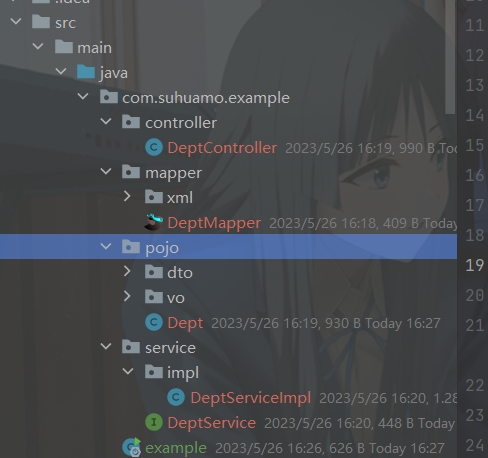

# 一个基本web的spring-boot-start框架 web-spring-boot-starter


## 前言

1. 对于一个项目的开发，基础代码的CRUD和实体类的生成每次都需要重复创建，这样是十分麻烦的。因此本项目上线，提供了基础代码的自动生成，包括了实体类的生成，接口的增删改查等。
2. 目前版本只支持springboot3，不兼容springboot3以下的版本.
3. 从此版本开始，后续的所有版本将会上传至maven中央仓库（暂无）

## 系统需求

  

## 当前版本

v1.0.0

## 系统介绍

- 目前整个系统分为两大模块
1. 基础模块：主要用于实现系统的增删改查自动生成功能，是默认配置的
2. 其他模块：包含了Jwt鉴权、异常处理、错误页面跳转等，可以通过yml进行取消。


### 最快上手

- 将此工程通过``mvn clean install``打包到本地仓库中。(目前1.0.0版本还没有加入maven中央仓库，无法进行直接依赖)

- 在你的工程中的``pom.xml``中做如下依赖

```xml
	<dependency>
		<groupId>com.suhuamo</groupId>
		<artifactId>web-spring-boot-starter</artifactId>
		<version>1.0.0</version>
	</dependency>
```

- 在``application.properties``或者``application.yml``中做如下的配置：（至于以上的配置说明后面的章节会讲到）

```yaml
spring:
  #数据源配置
  datasource:
    username: root
    password: 123456
    url: jdbc:mysql://localhost:3306/springboot?characterEncoding=utf8&useSSL=false&serverTimezone=UTC&
# web-starter的配置
suhuamo:
  web:
    mybatis:
      # 生成的包路径
      parent: com.suhuamo.example
      # 需要自动生成代码的数据库表
      tables:
        - tbl_user
        - tbl_emp
        - tbl_role
      # 生成代码时的java类去掉前缀，可为空
      tablePrefix:
        - tbl
```
- 以上配置好以后就可以写demo测试啦，首先创建进行代码的生成：

```java
@SpringBootTest
public class exampleTest {

    @Autowired
    MyBatisService myBatisPlusService;

    @Test
    public void GeneraCode() throws IOException {
        myBatisPlusService.generatorCode();
    }

}
```
点击运行后可发现代码已自动生成：如下

- 代码生成完毕后，就可以运行项目测试接口了:
